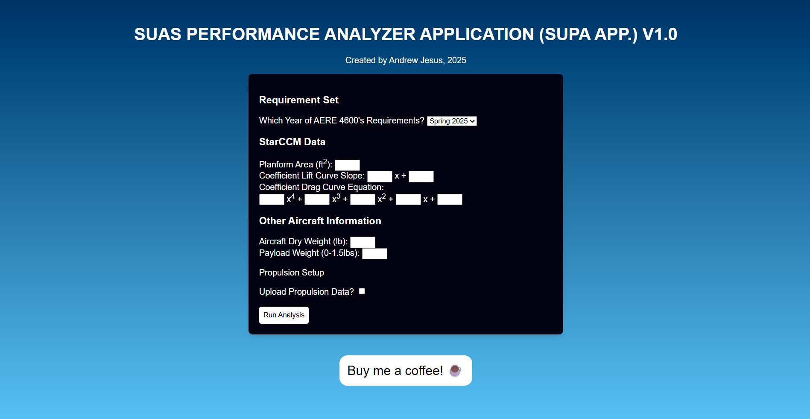

#  sUAS Performance Analysis App (sUPA App)
The **sUAS Performance Analysis App (sUPA App)** is a webapp made by **Andrew Jesus** for the **Iowa State University Senior Design class**. sUPA is a tool that runs analysis with **StarCCM** and **MotoCalc** data to provide estimates of sUAS performance and compares them to performance requirements provided in class.

---

## Table of Contents
- [About](#-about)
- [Project Structure](#-project-structure)
- [How to Contribute](#-how-to-contribute)
- [JSON File Guidelines](#-json-file-guidelines)
- [Running the Webapp](#-running-the-webapp)
- [Screenshots / Demo](#-screenshots--demo)
- [License](#-license)

---

## About
- Runs analysis on CFD and MotoCalc datasets.  
- Compares actual sUAS performance with course-defined requirements.  
- Built as a lightweight webapp (HTML, CSS, JavaScript, JSON).
---

## Project Structure
```text
    sUPA-App/
    ├── index.html
    ├── results.html
    ├── css/
    │ └── style.css
    ├── javaScripts/
    │ ├── resultScript.js
    │ └── script.js
    ├── requirements.json <-- Main file to edit
    └── README.md
```
## Contributions
If you would like to contribute to sUPA the best way is to update requirements.json to keep up-to-date with each semester's requirements following these steps.
- Fork this repo.  
- Create a feature branch for your changes.  
- Update **requirements.json** with new or modified requirements.  
- Submit a Pull Request for review. 

## JSON File Guidelines
**requirements.json** is set up to be a simple and effective way for requirements to be added. Currently, sUPA checks performance for endurance (in minutes), cruise altitude (in ft-msl), maximum cruise speed (in mph), and minimum cruise speed (in mph) for both threshold and objective requirements. Below is the layout of the json file.

**Example format:**
```json
    "Spring 2025": {
        "endurance": {
            "Threshold": 30,
            "Objective": 45
        },
        "Cruise Altitude": {
            "Threshold": 6000,
            "Objective": 9000
        },
        "Stall Speed": {
            "Threshold": 25,
            "Objective": 20
        },
        "Max Speed": {
            "Threshold": 45,
            "Objective": 50
        }
    }
```
## Running the Webapp
To use **sUPA** you can go to the website [here](https://babyheyzeus5.github.io/sUPA-App/).
Alternatively you can run locally:
# Clone the repo
git clone https://github.com/username/sUPA-App.git

# Open in a browser
cd sUPA-App
open index.html   # or just double-click index.html

## Screenshots / Demo
On the landing page 

## License